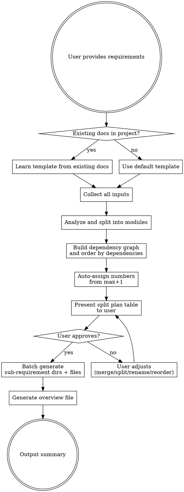

# Requirement Splitter

Split requirement documents and prototypes into structured, dependency-ordered sub-requirements with standardized documentation.

## Process Flow



## Checklist

You MUST complete these steps in order:

1. **Learn project template** — scan docs directory for existing requirement docs, extract template structure
2. **Collect inputs** — ask user for requirement source, read all inputs
3. **Analyze and split** — identify modules, build dependency graph, order and number
4. **Present plan** — show split table for user confirmation
5. **Generate files** — batch create sub-requirement directories and docs (every doc MUST include test section)
6. **Generate overview** — create summary file in docs root
7. **Output summary** — report what was generated

## Step 0 — Learn Project Template

Use Glob to scan the project's requirement docs directory (default `docs/`):

```
Glob: docs/**/需求.md
Glob: docs/**/*.md
```

**If `docs/` directory doesn't exist:** Ask the user for the docs directory path. If the project has no docs directory yet, create `docs/` after user confirms.

**If existing docs found:** Read 2-3 representative files. Extract:
- Directory naming convention (e.g., `{number}-{name}/`)
- Document structure (heading hierarchy, sections, fields) — reproduce the learned structure exactly
- Numbering format (plain numbers, prefixed, zero-padded) — use the same format for new numbers
- Find the current maximum number for auto-increment
- If multiple docs have conflicting structures, prefer the most recent or most complete one

**If no existing docs:** Use the default template (see below).

## Step 1 — Collect Inputs

Ask the user what requirement source to use. Support any combination of:

| Source | How to read |
|--------|-------------|
| Screenshot | Read tool (supports images) |
| Figma | `mcp__figma__get_screenshot` / `mcp__figma__get_metadata` (if Figma MCP unavailable, ask user for screenshots instead) |
| Text/Markdown | User pastes directly in chat |
| Local file | Read tool (md, pdf, doc, etc.) |

Read and understand ALL provided inputs before proceeding.

## Step 2 — Analyze and Split

From the input material:

1. **Identify independent functional modules** — each module should be a cohesive feature that can be developed and tested independently. If only one module is identified, inform the user that splitting is unnecessary and offer to generate a single requirement doc instead
2. **Analyze dependencies** — which modules depend on which. If circular dependencies are detected, flag them to the user and suggest merging the conflicting modules or breaking the cycle
3. **Topological sort** — order modules so dependencies come first
4. **Assign numbers** — starting from max existing number + 1
5. **Estimate priority and effort** — based on content analysis:
   - Priority: P0 (urgent), P1 (high), P2 (medium)
   - Effort: small / medium / large

## Step 3 — Present Plan for Confirmation

Show a table like:

| # | Name | Priority | Effort | Dependencies | Description |
|---|------|----------|--------|-------------|-------------|
| 19 | Feature A | P1 | medium | none | Brief desc... |
| 20 | Feature B | P1 | large | 19-Feature A | Brief desc... |

Tell the user they can: merge, split, reorder, rename, or modify dependencies. Apply changes and re-present until approved.

## Step 4 — Batch Generate

For each approved sub-requirement, create the directory and requirement doc:

```
docs/{number}-{name}/需求.md
```

**Template strategy:**
- If existing docs were found in Step 0: follow the learned template exactly
- If no existing docs: use the default template below

<HARD-RULE>
Every sub-requirement doc MUST include a test requirements section. This is NOT optional regardless of which template is used. If the learned template lacks a test section, ADD one.
</HARD-RULE>

### Default Template

When the project has no existing requirement docs, use this template:

```markdown
# {number} - {name}

> **Status: Pending**

## Basic Info

- **Priority**: P0/P1/P2
- **Dependencies**: {list or "None, can be developed independently"}
- **Effort**: small/medium/large

## Requirement Details

### 1. {feature point 1}
- Detailed description...

### 2. {feature point 2}
- Detailed description...

## Test Requirements

### Unit Tests
- ...

### API Tests
- ...

### Frontend Tests
- ...
```

### Filling Rules

- Extract requirement details from original input, preserve original wording and detail
- Priority and effort are inferred from content analysis
- Test requirements are generated based on the feature points — cover key scenarios

## Step 5 — Generate Overview File

Create a summary file at `docs/{topic}-requirements-overview.md`:

```markdown
# {Topic} Requirements Overview

> Generated: YYYY-MM-DD
> Source: {input source description}

## Sub-requirements

| # | Name | Priority | Effort | Dependencies | Status |
|---|------|----------|--------|-------------|--------|
| ... | ... | ... | ... | ... | Pending |

## Dependency Graph

{Text or indented description of dependency chains}

## Phases

### Phase 1 - {name}
- {number}-{feature}
- ...

### Phase 2 - {name}
- ...
```

## Step 6 — Output Summary

Report what was generated:
- Number of sub-requirements created
- List of directories and files
- Any notes or warnings

**Skill ends here.** Do NOT auto-invoke brainstorming, writing-plans, or any implementation skill.
